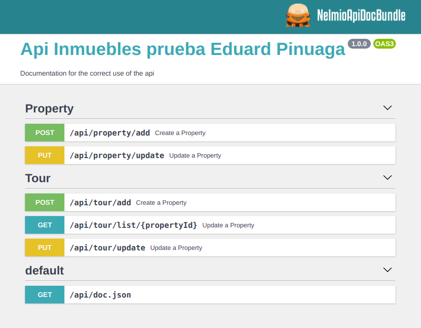
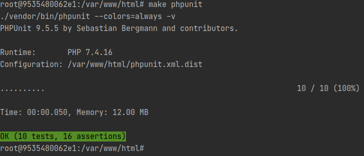
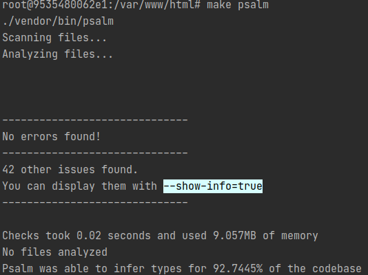

# Prueba

---

---
## Info del proceso y creación de la prueba:

### Entorno desarrollo

**Docker** con 3 servicios:
- nginx
- php
- mysql

**IDE**: PHPStorm

**SO**: Linux (Debian)

---

### Aplicación

- Symfony 5
- PHP 7.4
- Docker / Docker-Compose  
- Path doc api: `http://localhost:8080/api/doc`

Documentación API mediante: **Nelmio**

### Toma de decisiones

#### Endpoints

He optado por una arquitectura DDD. He usado CQRS en los comandos. Hay una Query sin usar CQRS, me dio problemas al cargar el Handler, por lo que lo hice sin CQRS.

#### Contexto:

He englobado los módulos **Property** y **Tour** dentro de  **Commercial**.

---
#### Relaciones:

En las relaciones he optado por solamente vincular el lado de **Tour** dejando libre el modelo **Property**,
siguiendo las recomendaciones para aplicaciones de alta concurrencia evitando así el arrastrar las relaciones cada vez
que se llama a **Property**.

Este supuesto puede cambiara dependido de las estrategias que se decidan llevar a cabo. Por ejemplo en el caso de querer hacer
una relación entre entidades hubiera puesto en **Property** una colección objetos **Tour**.

He creado un endpoint  `api/tour/list/{propertyId}` extra para conseguir el listado de Tours por Property.

Esta estructura  podría  ser consumida por una aplicación creada con Angular: Donde teniendo
la ficha **Property** se puede hacer una segunda llamada asíncrona
para traer el listado de `Tours` asociados mediante el endpoint `api/tour/list/{propertyId}`

---

### Testing

#### Phpunit
Run Phpunit: `./vendor/bin/phpunit`

---

#### Psalm
Run Psalm: `./vendor/bin/psalm`

--- 
---

### Requerimientos:

#### REST API sin autenticación
Tenemos una aplicación para gestionar tours virtuales. Las agencias inmobiliarias que
gestionan pisos en alquiler quieren hacer un tour virtual cada vez que el inmueble cambia de
inquilinos para llevar la trazabilidad visual del estado de ese inmueble en cada transacción.

La tarea consiste en implementar una REST API que sea capaz de dar de alta y modificar
inmuebles y los tours virtuales asociados al inmueble.

Los endpoints son los siguientes:

Añadir inmueble  `/api/property/add`

Modificar inmueble  `/api/property/update`

Añadir tour virtual  `/api/tour/add`

Modificar tour  `/api/tour/update`

Las dos entidades tienen estas propiedades...

**Inmueble**

- Id: identificador único del inmueble
- Título: string
- Descripción: string
- Tours: colección de objetos tours

**Tour**

- Id: identificador único del tour
- Inmueble: objeto inmueble al que pertenece
- Activo: boolean indicando si el tour està activado o desactivado
